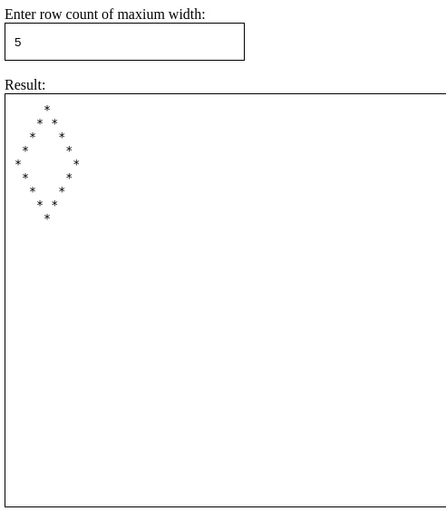

# Draw Diamond with Star Character

## Expected Outcome
```
    *
   * *
  *   *
 *     *
*       *
 *     *
  *   *
   * *
    *
```
​


>The goal is to draw a filled diamond shape in the textarea using the asterisk (*) character. Get the number of rows from the user and draw the diamond shape accordingly. Add an event listener to the input field and call the function when the user enters or changes the value.

>Amaç, yıldız karakterini (*) kullanarak textarea alanına dolu bir elmas şekli çizmektir. Satır sayısını kullanıcıdan alın ve elmas şeklini buna göre çizin. Giriş alanına olay dinleyicisi ekleyin ve kullanıcı değeri girdiğinde veya değiştirdiğinde işlevi çağırın.


## Learning Outcomes

At the end of the this coding challenge, students will be able to;

- Analyze a problem, identify and apply programming knowledge for appropriate solution.

- Demonstrate their knowledge of algorithmic design principles by using JavaScript effectively.

- Use the DOM to manipulate the page.

- Become familiar with the DOM Events API.

## Problem Statement

### Sample Input
Enter row count of maxium width: `5`


